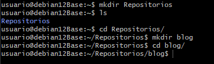
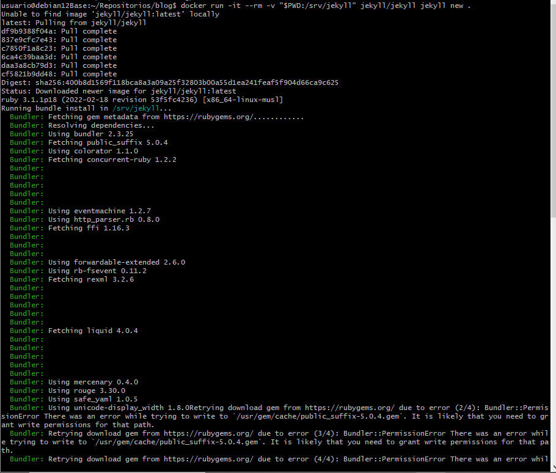
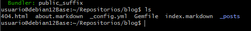
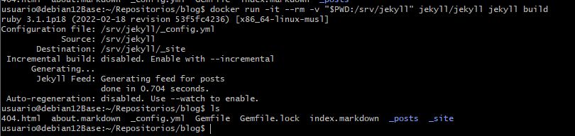
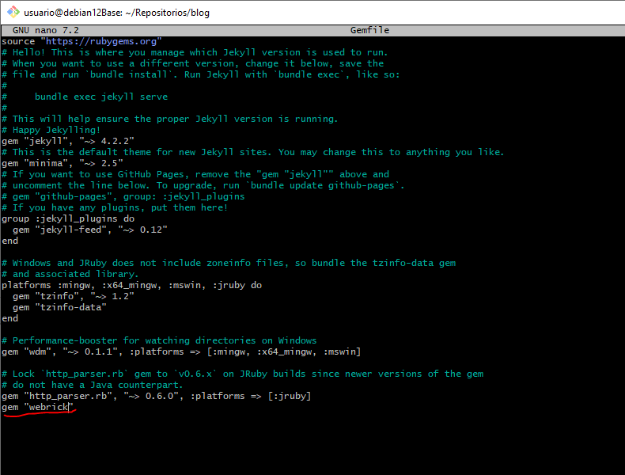
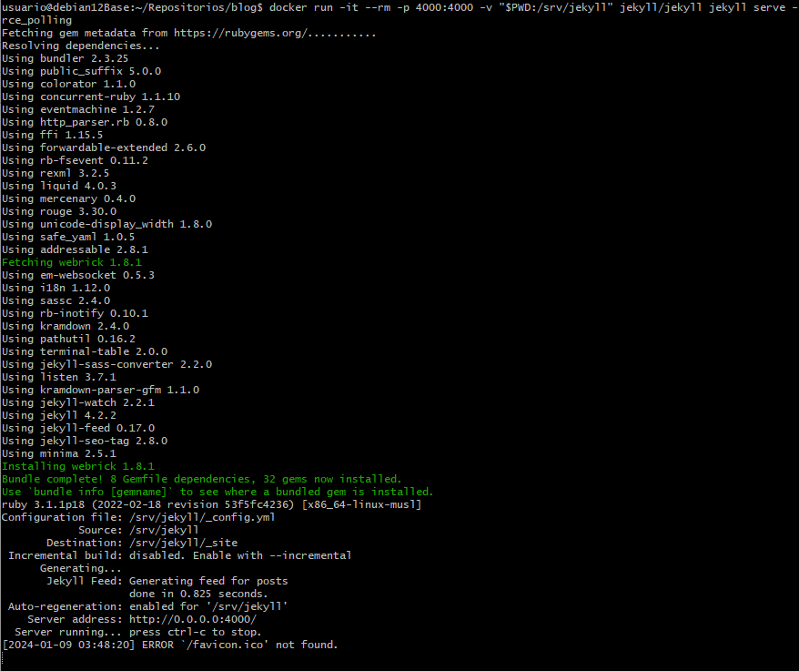
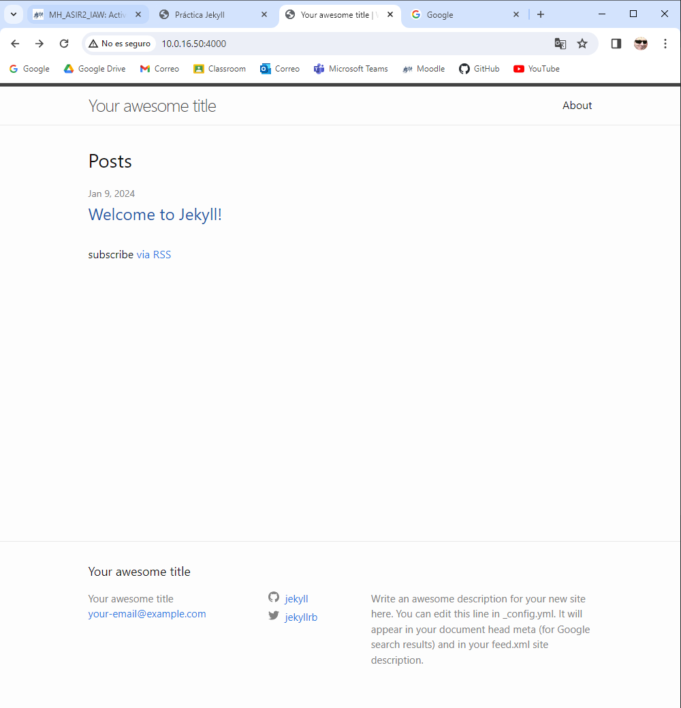

# Actividad 1.2 Sitio Local en Jekyll con Dockers
## 1. Lo primero creamos el repositorio donde estara todo lo relacionado con la tarea.

## 2. Despues mediante el comando de la siguiente captura, crearemos la estructura de directorios y los archivos necesarios de nuestro sitio Jekyll.

### Aqui podemos ver como se han creado correctamente todos los archivos.

## 3. Este comando permite generar un sitio HTML a partir del contenido creado en el punto anterior.

## 4. Ahora deberemos añadir la siguiente linea al fichero Gemfile para que no nos perjudique en los siguiente pasos ---> ***gem "webrick"***

## 5. Por ultimo, haremos dicho sitio HTML de forma local para poder trabajar con ello más facilmente.

## 6. Gracias al anterior paso, podremos acceder a nuestro sitio web mediante la ip de la maquina y el puerto asignado anteriormente.
