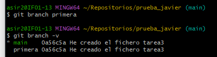
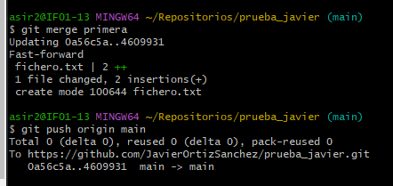
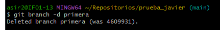
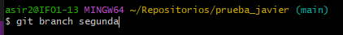
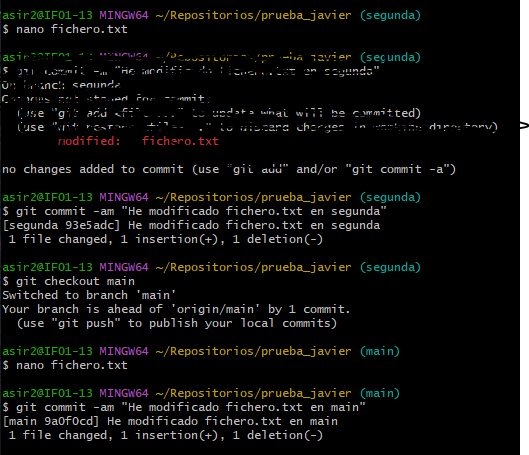
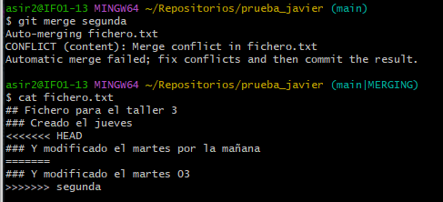
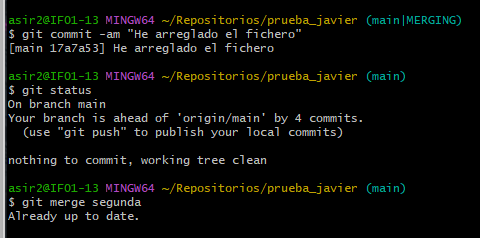
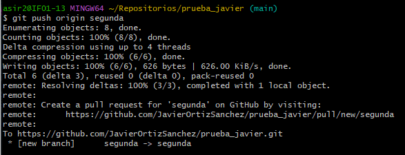
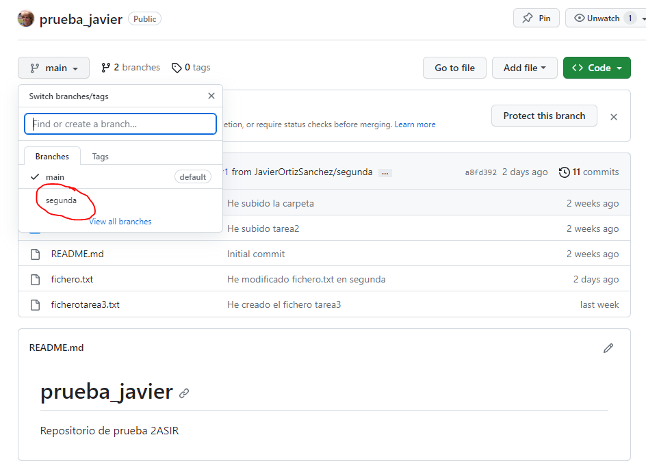

### 1.Crea una rama que se llame primera en tu local, y ejecuta la instrucción necesaria para comprobar que se ha creado.

### 2.Crea un nuevo fichero en esta rama y fusiónalo con la principal. ¿Se ha producido conflicto? Razona la respuesta.
  
No pasa nada ya que al no modificar el fichero en la rama main no hay ningun problema.
### 3.Borra la rama primera.

### 4.Crea una rama que se llame segunda, y modifica un fichero en ella para producir un conflicto al unirlo a la rama principal. Entrega el contenido del fichero donde se ha producido el conflicto.

  
Aqui si que hay problema ya que he modificado el fichero en ambas ramas, provocando así un problema al fusionarlas.
### 5.Soluciona el conflicto que has creado en el punto anterior y sincroniza la rama segunda en el remoto. Entrega una captura de pantalla donde se vea que se ha creado la rama en el repositorio de GitHub.
Aqui arreglamos el fichero borrando la parte que deseamos quitar.

