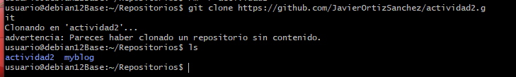
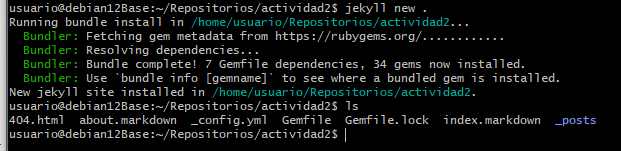
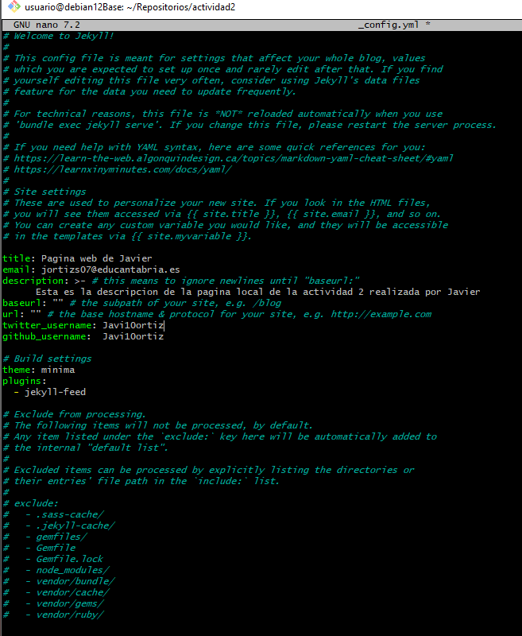
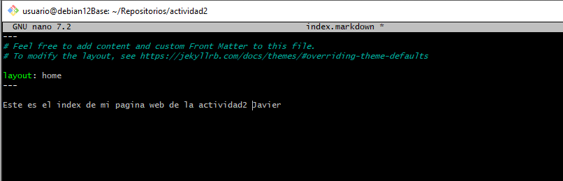
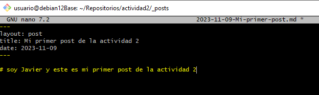
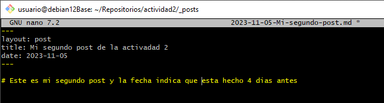
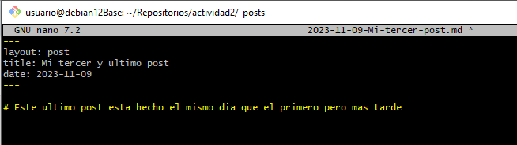
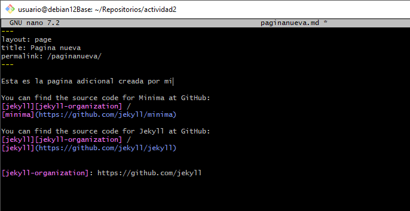
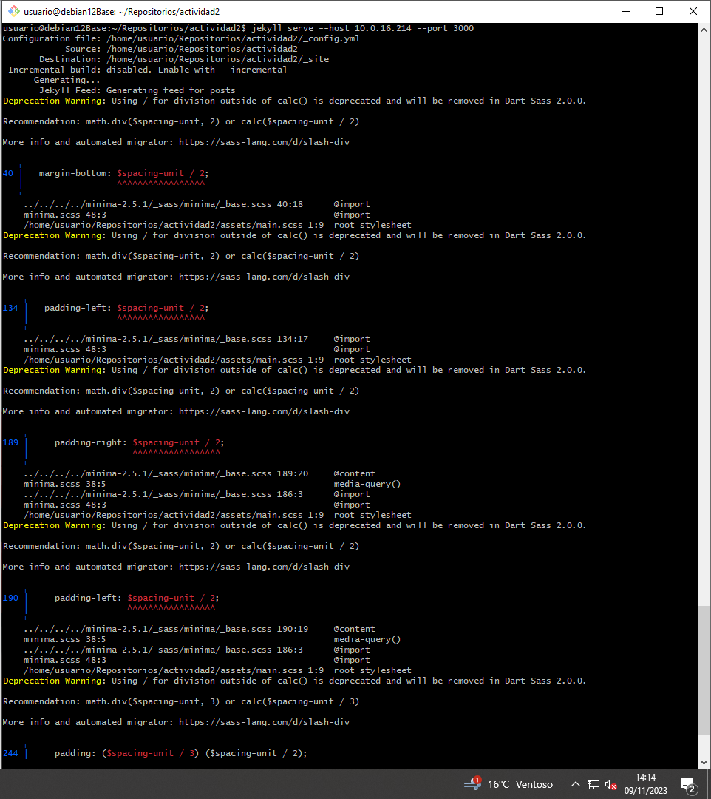
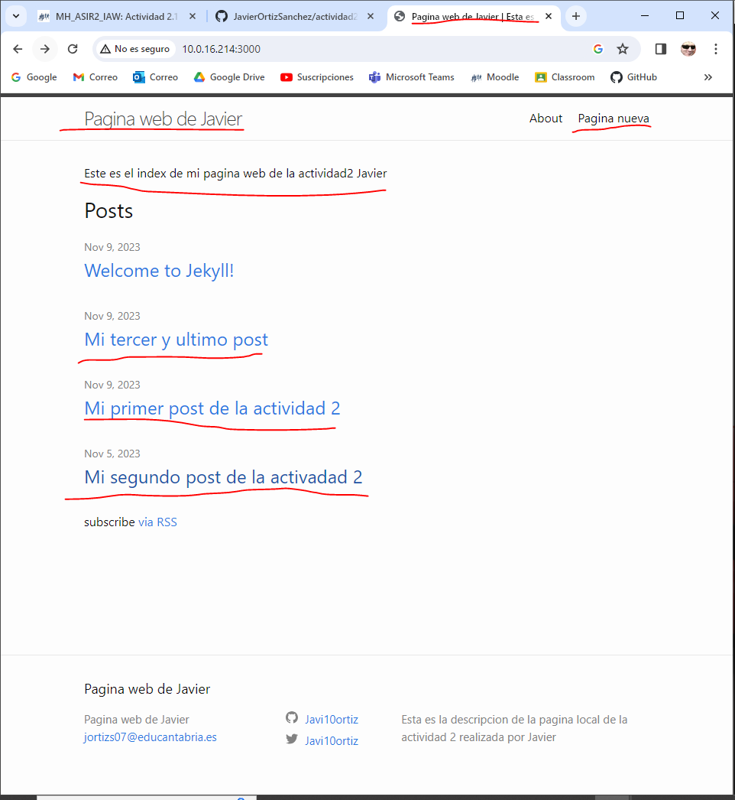

## 1. Primero clonamos el repositorio, en este caso actividad2, para poder trabajar con el **localmente**.

## 2. Empezamos a trabajar con Jekyll, y para ello crearemos el sitio. Para ver la comprobacion haremos un ls y veremos como se han creado todos los archivos correspondientes.

## 3. Para configurar y personalizar la pagina habrá que editar ciertos ficheros, empezando en este caso con _config.yml, que servirá para cambiar el nombre de la pestaña.

## 4. Tambien editaremos el archivo index.md, que servirá para cambiar el cuerpo de la página.

## 5. Tambien crearemos 3 post nuevos con diferentes fechas para que una vez estemos en la página web entes ordenadas de forma diferente.

## 6. Ademas haremos una nueva pagina que aparecera junto al about ya hecho.

## 7. Una vez creados y editados los ficheros que deseemos, iniciaremos la página gracias al comando:
        jekyll serve - -host 10.0.16.200 - -port 3000
## donde indicaresmos tanto la ip del host como el puerto.

## 8. Una vez activado, pondremos la ip junto al puerto en el navegador y nos aparecerá nuestra pagina
